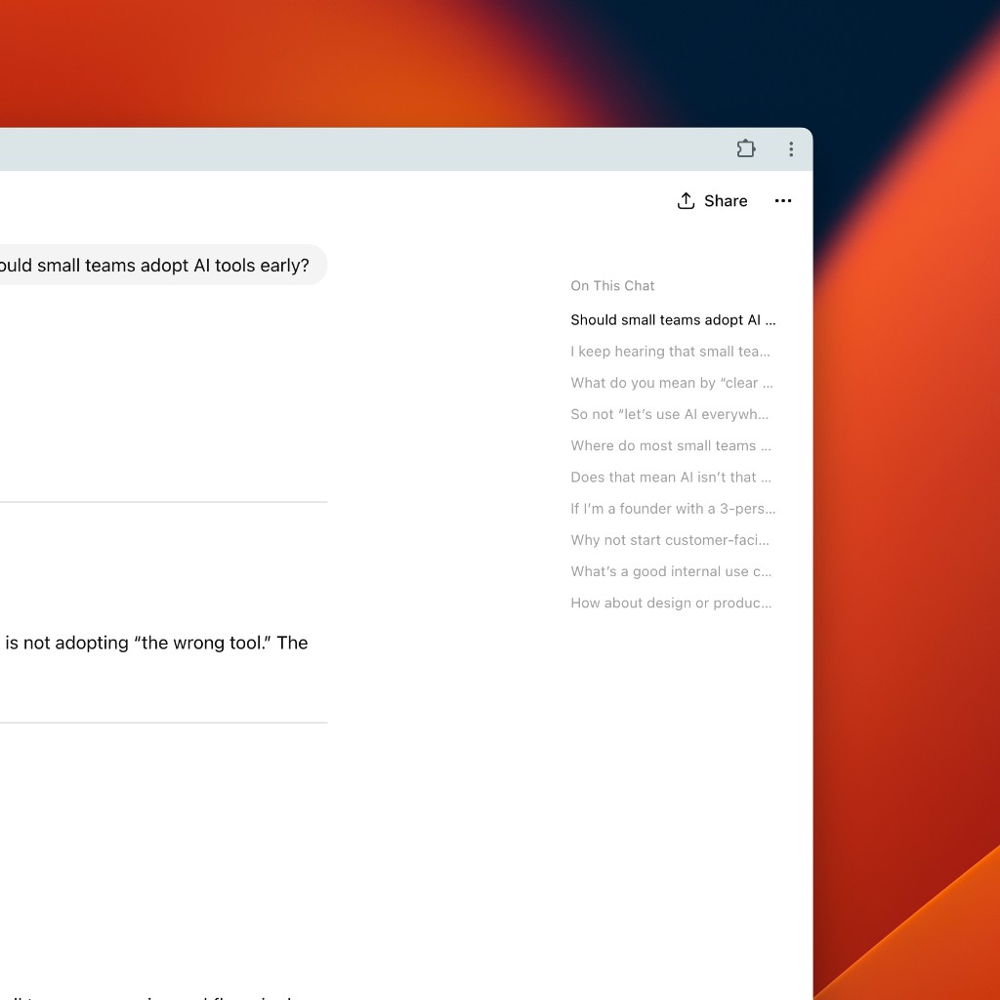
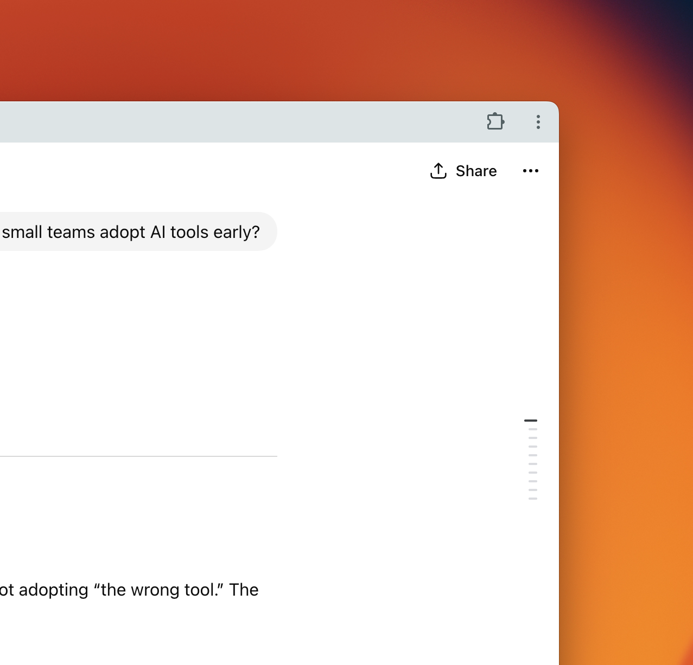
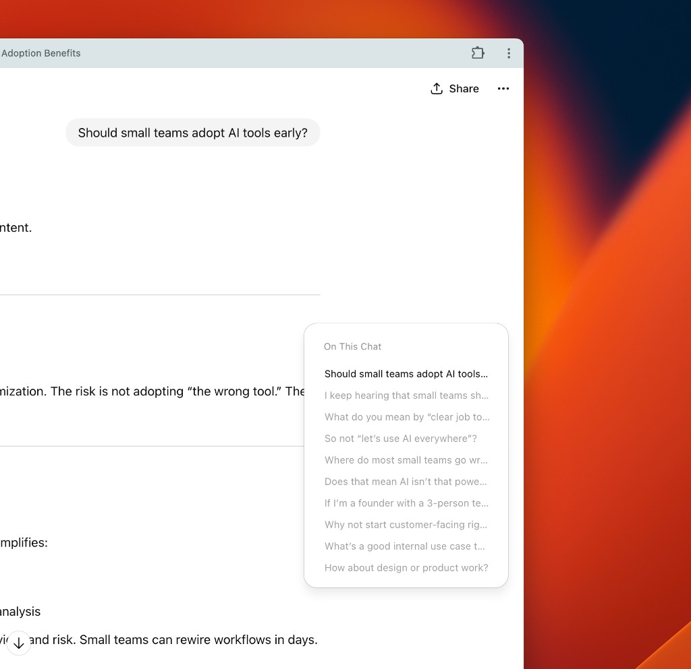

# On This Chat

A Chrome extension that adds a **table of contents** to ChatGPT conversations. Handy for long threads: jump to any user message or assistant section (H1/H2) from a sidebar or compact rail.

### Preview

| Wide | Compact Rail | Popover |
|----------------|---------------|---------|
|  |  |  |

**[Video walkthrough 👉](https://youtu.be/hdd1kYpZy4E)**

## Features

- **Sidebar TOC** on wide viewports: scrollable list with user messages and assistant headings (H1/H2)
- **Compact rail** on narrower screens: dot indicators that expand to the full list on hover
- Smooth slide-in animations, active section highlighting, and scroll sync
- Works on [chatgpt.com](https://chatgpt.com) and [chat.openai.com](https://chat.openai.com)
- Supports dark mode theme

## Installation

1. Clone or download from [github.com/andrewabogado/on-this-chat](https://github.com/andrewabogado/on-this-chat).
2. Open Chrome → **Extensions** → **Manage extensions** → **Load unpacked**.
3. Select the folder containing `manifest.json`.
4. Visit a ChatGPT conversation; the TOC appears when the page has content.

## Usage

- **Wide viewport**: TOC appears as a sidebar on the right. Click an item to scroll to that section.
- **Narrow viewport**: A thin rail with dots appears; hover to open the full TOC in a popover.
- Use the extension icon to toggle the TOC on or off (if needed).

## Project layout

| File          | Role |
|---------------|------|
| `manifest.json` | Chrome extension manifest (MV3). |
| `background.js` | Service worker; handles icon click and scripting. |
| `content.js`    | Injected into ChatGPT; builds TOC, scroll sync, compact/popover logic. |
| `styles.css`    | Sidebar, rail, popover, and animation styles. |

## Contributing

Contributions are welcome. See [CONTRIBUTING.md](CONTRIBUTING.md) for how to run, test, and submit changes.

## Security

See [SECURITY.md](SECURITY.md) for practices and how to report vulnerabilities.

## License

MIT — see [LICENSE](LICENSE).
